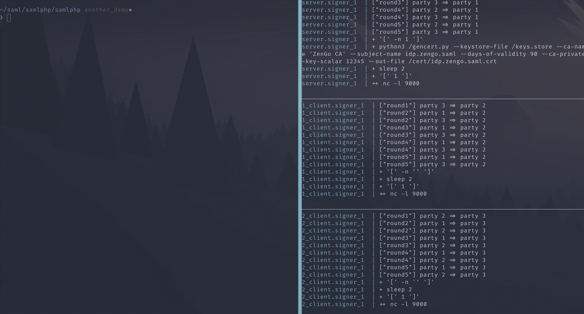

# MFA-ing the Un-MFA-able - Demo Repo
Thank you for checking out our demo repo following our BHUSA talk *"MFA-ing the Un-MFA-able"*.

The talk was given by:
- Tal Be'ery ([@TalBeerySec](https://twitter.com/TalBeerySec))
- Matan Hamilis ([@MHamilis](https://twitter.com/MHamilis))

## Setup Instructions
### Prerequisites
This has only been tested on my MacOS machine, but should probably work on linux as well.

- Docker
    - Each part of the system will be running in a separate docker container.
    - If you have the `docker` shell command - you're all set.
    - Otherwise visit Docker Website at: https://docs.docker.com/get-docker/
- [Optional] **OpenSSL**
    - Will be used to display the generated certificate as part of the show.
    - If you have the `openssl` shell command - you're all set.
    - Otherwise install it using you're distribution's package manager such as:
        - `brew install openssl` on MacOS.
        - On various Linux distros, consult your package manager.
        - You can also compile openssl on your own: https://www.openssl.org/source/
- [Optional] A shell running within a **tmux**
    - This is used for splitting the screen to display the activity of the three parties interacting with each other.
    - If you have `tmux` shell command and running `[ -z "$TMUX" ] && echo "no" || echo "yes"` outputs `yes` - you're all set!
    - Otherwise follow the instructions here: https://github.com/tmux/tmux/wiki/Installing

### Setting up Hostnames
- Add the two following entries to your hosts file:
    - `sp.zengo.saml 127.0.0.1`
    - `idp.zengo.saml 127.0.0.1`
- The hosts file can found at `/etc/hosts` in Linux/MacOS.

### Building & Running
Just run `./run_demo.sh`.
It will automatically build and run all parts of the demo. 
Notice that the first run can take a few minutes to download and build all the images.

### Using the Service
Once setup is complete browse to the service provider (SP) at: https://sp.zengo.saml.

If you are getting a warning message from your browser gently ask it to ignore it. 
This happens because our certificates are self-signed and cannot be verified. 
These certificates were generated on your PC.

- Once you've entered the service provider's home page press the *authentication* tab.
- Next, press the *Test configured authentication sources* link.
- Next, press the *Demo-IDP* link.
- At this point you should be redirected to you the identity provider's (IDP) page with a login form.
- The login credentials are hardcoded as:
    - username: `student`
    - password: `studentpass`
- Hit the login button. At this point a signature is generated in a distributed manner by the three co-signers.
- Once the login is done you will be redicted to the SP page with the SAML assertion presented to you.

### Stopping the Service
Simply run, within the project's root directory, the `docker compose down` command.
This takes a few seconds to shutdown all services.

### Some Credit
In writing this code We have also used the following repos:
- https://github.com/rciam/simplesamlphp-module-themevanilla
- https://github.com/simplesamlphp/docker-simplesamlphp
